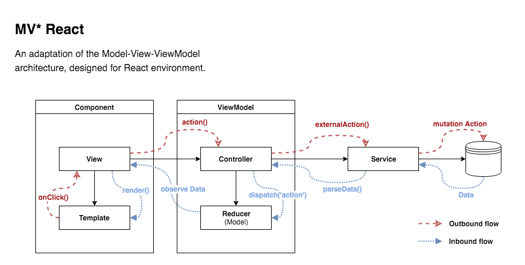
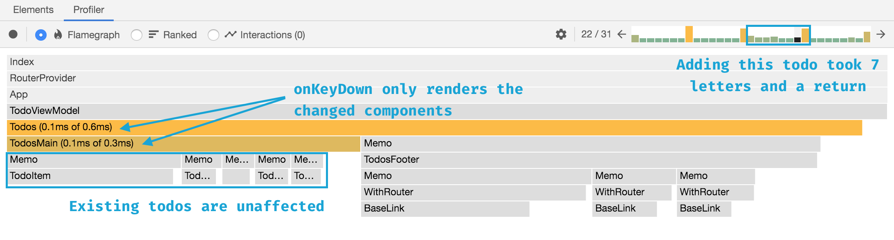
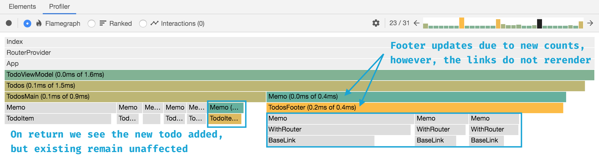

# React MV* Design Pattern


[](https://app.netlify.com/sites/mvreact/deploys)

This repo provides an application of the MVVM pattern to a React based version of the TodoMVC project. 
The design pattern has been adapted to fit the idiosyncrasies of React development, focusing on the recent adoption
of contexts and hooks.

> This architecture assumes React >= 16.8

A demo is available [here](https://mvreact.netlify.com/).

## Background

React as a concept exists as the V in MV*. Granted, there have been any number of projects created that work in some
fashion to bring non-view logic into the view. Declarative routers, graphql clients, and other forms of high-order
components have demonstrated that it is quite easy to introduce anti-patterns.

This architecture reintroduces a separation of concerns, allowing for non-view functionality to remain abstracted
and focused on a single responsibility.

## Concepts

The following illustrates the basic flow of within the architecture:



### Component

Components consist of a the prototypical view layer, and marked up template.

**Views** are concerned with only handling logic internal to the component, and connecting to the **ViewModel**.
A template is passed data through props -- or contextually as a top level view. Events are dispatched
to a **Controller** for handling.

### ViewModel

The ViewModel provides the glue between user interaction and model manipulation.

A **Controller** acts as an intermediary layer for interpreting raw user actions, converting them to business functions.
The controller is responsible for requesting data updates, either from external services or local state, as well as
informing the **Reducer** when state has been updated.

A **Reducer** is used to maintain data bindings (unidirectional) with the view. When the reducer updates state, the
view updates accordingly. It is triggered through a `dispatch` call invoked by the **Controller**.

> **A note on State Management**
>
> State management follows the same design principles as Redux, MobX (react-lite), Unstated (next), _et al_. 
> It does so, however, without the use of an external library, instead relying on React's `useReducer` hook.
> 
> Although the view model architecture currently uses the native reducer, there is nothing that dictates it must
> do so. The only necessity is that the view controller is able to inform React that state has changed; how it 
> accomplishes this is very flexible.

### Service

Services, as in a typical MV\* architecture, are responsible for communication with external data sources. The data
is parsed and formatted prior to consuming by the **Controller**.

This may seem a bit of a departure when used to using tools like Apollo declaratively within the view. However, it
provides a solid separation of concerns, increases testability, and enforces SRP practices.

## Guidelines

### Structure

In general a project should follow a sane layout, separating visual components from functionality. 
One caveat to this is the placement of `App.jsx` and `index.jsx`, which are elevated given their status as roots.

To this point, the following project structure has been followed:

```
src/
  - components/
    - atoms/
      - BasicElement/
        - index.jsx
    - molecules/
      - ComplexElement/
        - index.jsx
    - organisms/
      - ComplexSection/
        - index.jsx
    - pages/
      - SomePage/
        - _SomePagePartial.jsx
        - index.jsx
  - hooks/
  - routes/
  - services/
    - graphql/
      - queries/
        - some_query.gql
      - mutations/
        - some_mutation.gql
    - some_service.js
  - view_models/
    - SomeViewModel/
      - index.js
      - reducer.js
  - App.jsx
  - index.html
  - index.jsx
  - router.js
```

### Components

Components have the responsibility of defining the layout, displaying data, and handling direct user interaction 
prior to interpretation by business logic. Components can either be simple building blocks or complex elements. 
In some cases, they can contain significant code and layout instruction, or represent the entry point for a user.

To meet all these varied responsibilities while providing a cognative delineation, we separate into four basic 
classes, borrowed from "Atomic Design".

atom
: a basic building block that cannot be subdivided; i.e. `Button`, `Text`, `Input`

molecule
: a component element composed of a few atoms or other molecues without little to no logic; 
i.e. `FormField`, `ButtonGroup`, `Card`

organism
: a complex component composed of many atoms and molecules, having significant logic; 
i.e. `VideoPlayer`, `ImageCarousel`

page
: a top level component to act as an entry point for a given view; 
i.e. `Todos`, `EditUser`

Under this architecture, only page components receive ViewModels. Organisms and below are passed their properties 
and event handlers through props.

> **Page Partials**
>
> Often there is the need to break out a component into a self contained module, yet
> reusability is not a factor. An example could be an item renderer for a list, in which
> there is no other instance in the application.
>
> In this case, we follow a standard practice of creating a "partial". These components
> exist within the context of the page -- under its path, and are prefixed with an
> underscore "\_".

### Performance Tweaking

When React renders a component, it renders all of the nested components as well, regardless of change.
Normally, one might never notice as it's only a few hundred microseconds per component. However, 
as one increases the number of items being rendered this adds up. If state has changed for only one item
in a large tree, it seems rather wasteful to rerender everything.

React provides a useful tool to prevent this behavior, named `memo`, allowing us to easily compare previous and next state
to determine if a change is warranted.

#### Analysis 

This repo includes `React.memo` in a few areas and the improvements are immediately visible.



With memo in place, `TodoItem` components no longer render simply because a user is typing a new todo into the
`TodosMain` component. It's actually quite clear now, as well, on which interaction the todo is saved and state is
updated.  



Displaying the profile for the save interaction demonstrates that even when the `todos` list state changed, only
the new item renders a `TodoItem` component. Likewise, the counts for total items changed forcing an update to
`TodosFooter`. But again we can see that the memoized router links have no need to change and so do not render. 
